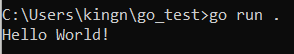

# BoltDB

- История развития СУБД

В 2013 году Бен Джонсон начал работу над BoltDB вдохновленный LMDB (Lightning Memory-Mapped Database) как порт для нее. Но потом два проекта разошлись и Джонсон решил сосредоточиться на простоте и легком использовании API. Bolt задумывался как просто key-value хранилище без посторонних фичей, это встраиваемая СУБД написанная на Go. Целью было сделать простую, быструю и надежную базу данных, которой не требуется полноценный сервер. Работа над BoltDB закончилась в 2017, API фиксировано, и есть полное покрытие юнит-тестами, а также использовано тестирование по стратегии черного ящика для подтверждения консистентности и потоковой безопасности. 

- Инструменты для взаимодействия с СУБД

Чтобы использовать BoltDB достаточно установить Go, `go get [github.com/boltdb/bolt](http://github.com/boltdb/boltз)` затем `import “github.com/boltdb/bolt”`

Чтобы начать работу, достаточно сделать bolt.Open(). 

Пример простого кода с созданием, добавлением и получением данных:

```go
package main
import (
    "fmt"
    "github.com/boltdb/bolt"
    "log"
)
var world = []byte("greeting")
func main() {
		//create database
		// if there is no bolt.db file, it will be created
    db, err := bolt.Open("C:/Users/kingn/go_test/bolt.db", 0644, nil)
    if err != nil {
        log.Fatal(err)
    }
    defer db.Close()
    key := []byte("hello")
    value := []byte("Hello World!")
    // store data
    err = db.Update(func(tx *bolt.Tx) error {
				//create bucket
        bucket, err := tx.CreateBucketIfNotExists(world)
        if err != nil {
            return err
        }

        err = bucket.Put(key, value)
        if err != nil {
            return err
        }
        return nil
    })
    if err != nil {
        log.Fatal(err)
    }
		//get data
    err = db.View(func(tx *bolt.Tx) error {
				// Assume bucket exists and has keys
        bucket := tx.Bucket(world)
        if bucket == nil {
            return fmt.Errorf("Bucket %s not found!", world)
        }
        val := bucket.Get(key)
        fmt.Println(string(val))
        return nil
    })
    if err != nil {
        log.Fatal(err)
    }
}
```

Вывод:



- Какой database engine используется в вашей СУБД?

Key-value хранилище на B+деревьях, но в узле не хранится указатель на соседние узлы , что замедляет сканирование по диапазону в угоду меньшей памяти. Балансировка также отличается от классической и состоит только из разделения и слияния (без поворотов), также балансировка производится только после коммита, чтобы избежать отмены изменений если транзакция будет откатываться.

Каждому узлу соответствует одна или несколько страниц. В каждой странице хранится: id, flags, count, overflow, ptr

- `flags` - тип страницы
- `count` - количество пар ключ-значение
- `overflow` - количество overflow страниц, если узел большой
- `ptr` - указатель в зависимости от типа страницы


для узла не-листа


хранятся ключи и указатели на ключи, так как у указателей фиксированный размер, то можно легко найти ключ

для узла листа


вместо pgid хранится vsize и после ключей находятся значения

- Как устроен язык запросов в вашей СУБД? Разверните БД с данными и выполните ряд запросов.

Отдельного языка запросов нет, все делает через API и операциями чтение/добавление/удаление.

Этот код кладет три пары ключ-значение и выводит их подряд с помощью Bucket.Cursor() - так как BoltDB хранит все ключи в байтовом виде, то можно быстро по ним итерироваться 

```go
package main
import (
    "fmt"
    "github.com/boltdb/bolt"
    "log"
)

func main() {
    db, err := bolt.Open("C:/Users/kingn/go_test/bolt.db", 0644, nil)
    if err != nil {
        log.Fatal(err)
    }
    defer db.Close()	
	  key1 := []byte("a")
    value1 := []byte("value a")
	  key2 := []byte("b")
	  value2 := []byte("value b")
	  key3 := []byte("c")
	  value3 := []byte("value c")

    err = db.Update(func(tx *bolt.Tx) error {
        bucket, err := tx.CreateBucketIfNotExists([]byte("MyBucket"))
        if err != nil {
            return err
        }
		    fmt.Println("Putting keys and values...")

        err = bucket.Put(key1, value1)
        if err != nil {
            return err
        }
		    err = bucket.Put(key2, value2)
        if err != nil {
            return err
        }
		    err = bucket.Put(key3, value3)
        if err != nil {
            return err
        }
        return nil
    })
	err = db.View(func(tx *bolt.Tx) error {
			b := tx.Bucket([]byte("MyBucket")
			c := b.Cursor()

			for k, v := c.First(); k != nil; k, v = c.Next() {
					fmt.Printf("key=%s, value=%s\n", k, v)
			}
			return nil
	})
	if err != nil {
        log.Fatal(err)
    }
}
```

Вывод:


- Распределение файлов БД по разным носителям?

Вообще BoltDB в явном виде не поддерживает партицирование, вся база данных это один файл. 

По словам разработчика, можно использовать разделение внутри кластера для балансировки нагрузки, но придется использовать дополнительно, например, согласованное хэширование для поиска нужной части.

- На каком языке/ах программирования написана СУБД?

На Go

- Какие типы индексов поддерживаются в БД? Приведите пример создания индексов.

Индексы не используются и каждый ключ надо добавлять отдельно. Но можно сделать “что-то вроде индексов” отдельный bucket (пространство пар ключ-значение, каждый ключ уникален, но можно хранить одни bucket внутри других), в котором сделать отдельный ключ вместо индекса для удобного поиска.

- Как строится процесс выполнения запросов в вашей СУБД?

При получении запроса на добавление/изменение пары ключ-значение или получения значения по ключу выполняются итерации прохода по дереву, пока нужный ключ не будет найден.

- Есть ли для вашей СУБД понятие «план запросов»? Если да, объясните, как работает данный этап.

Плана запросов в BoltDB нет

- Поддерживаются ли транзакции в вашей СУБД? Если да, то расскажите о нем. Если нет, то существует ли альтернатива?

Bolt допускает только одну read-write транзакцию за раз, но разрешает сколько угодно read-only транзакций за раз. Каждая транзакция имеет согласованное представление данных в том виде, в каком они существовали на момент начала транзакции.

Отдельные транзакции и все созданные из них объекты (например, бакеты, ключи) не являются потокобезопасными. Чтобы работать с данными в нескольких горутинах [параллельные операции, которые могут выполняться независимо от функции, в которой они запущены], надо запускать транзакцию для каждой из них или использовать блокировку, чтобы гарантировать, что только одна горутина обращается к транзакции за раз. Создание транзакции из БД является потокобезопасным.

Read-only транзакции и read-write транзакции не должны зависеть друг от друга и, как правило, не должны открываться одновременно в одной горутине. Это может привести к взаимоблокировке, так как транзакция чтения-записи должна периодически повторно отображать файл данных, но она не может этого сделать, пока открыта транзакция только для чтения.

- Какие методы восстановления поддерживаются в вашей СУБД. Расскажите о них.

Если во время транзации db.Update вернется ошибка, то транзакция не завершится и данные не будут записаны вовсе. Таким образом, в BoltDB не совсем восстановление, а просто сохранение состояния с ранее зафиксированными данными.

- Расскажите про шардинг в вашей конкретной СУБД. Какие типы используются? Принцип работы.

Как и партицирование, шардирование в данной бд не поддерживается.

- Возможно ли применить термины Data Mining, Data Warehousing и OLAP в вашей СУБД?

Не применимы, как и партицирование и шардинк

- Какие методы защиты поддерживаются вашей СУБД? Шифрование трафика, модели авторизации и т.п.

Никакие, можно подключиться к бд в получить любые данные

- Какие сообщества развивают данную СУБД? Кто в проекте имеет права на коммит и создание дистрибутива версий? Расскажите об этих людей и/или компаниях.

у BoltDB есть модификации, дополняющие ее функциональность, например

1. bbolt - fork основного репозитория, разработка ведется до сих пор. Там есть багфиксы, улучшение производительности и дополнительные фичи. Можно хоть сейчас пойти и создать pull-request :)
2. Storm - простой и мощный инструментарий для BoltDB, предоставляет индексы и дополнительные методы хранить и получать данные, а так же улучшенная система запросов
- Создайте свои собственные данные для демонстрации работы СУБД.

В рамки задания не входило сильно вникать в язык Go, чтобы сгенерировать много данных, загрузить их в бд и проверить скорость работы. Вместо этого, я нашла данные о скорости работы BoltDB:

Бенчмарки [функции тестирования производительности в Go]:

- BenchmarkGetSmall — получить определенный ключ с маленьким (64 kB) значением

- BenchmarkGetLarge — получить определенный ключ с большим (2932 kB) значением

- BenchmarkSetSmall — записать определенный ключ с маленьким значением

- BenchmarkSetLarge — записать определенный ключ с большим значением

Два датасета:

1. 10 000 ключей со значениями по 64 КБ (маленьких) и 2 932 КБ (больших), распределенных поровну.
2. 50 000 ключей со значением состоят из 64 КБ (маленьких) и 2 932 КБ (больших), распределенных поровну

На машине с 4-ядерным процессором, 8гб RAM 

Датасет 10 000 ключей:


Датасет на 50 000 ключей:


На машине с 8-ядерным процессором, 16гб RAM

Датасет на 10 000 ключей:


Датасет на 50 000 ключей:


Как видно из этого, BoltDB очень хороша в чтении, но не так хороша для записи

- Как продолжить самостоятельное изучение языка запросов с помощью демобазы. Если демобазы нет, то создайте ее.

Простой туториал с объяснениями шагов: [https://developpaper.com/introduction-to-boltdb-database-of-golang-high-performance-persistence-solution/](https://developpaper.com/introduction-to-boltdb-database-of-golang-high-performance-persistence-solution/)

Статья про BoltDB простыми словами [https://www.progville.com/go/bolt-embedded-db-golang/](https://www.progville.com/go/bolt-embedded-db-golang/)

Лучший вариант - официальная документация [https://pkg.go.dev/github.com/boltdb/bolt](https://pkg.go.dev/github.com/boltdb/bolt)

- Где найти документацию и пройти обучение

в репозитории на гитхабе [https://github.com/boltdb/bolt](https://github.com/boltdb/bolt) есть README файл с хорошим туториалом для начала работы, на [https://pkg.go.dev/github.com/boltdb/bolt](https://pkg.go.dev/github.com/boltdb/bolt) также можно посмотреть ссылки на избранные файлы исходного кода (если не хочется искать их по всему основному репозиторию)

- Как быть в курсе происходящего

Следить за коммитами в репозитории bbolt :)